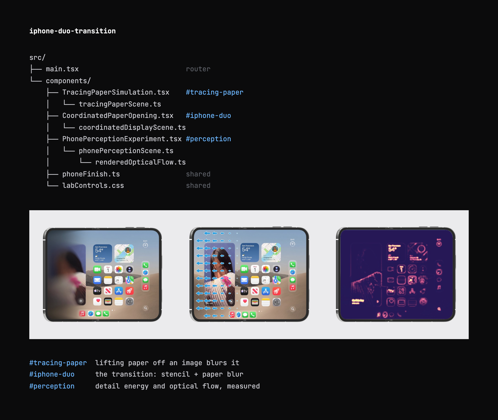

# [Why the iPhone Duo Folding Transition Feels Good →](https://armandsumo.com/posts/iphone-duo-transition/)



```sh
npm install && npm run dev
```

Live: [tracing-paper](https://armandsumo.com/labs/tracing-paper/) · [iphone-duo](https://armandsumo.com/labs/iphone-duo-transition/) · [perception](https://armandsumo.com/labs/iphone-duo-perception/)

Supply these locally (gitignored; not covered by the license):

```
public/assets/tracing-paper/lake-of-zug-turner-1843.jpeg
public/assets/tracing-paper/iphone-duo-clean-background.jpeg
public/assets/tracing-paper/iphone-duo-folded-cover.png
public/assets/tracing-paper/tomaselli-newspaper-reference.jpg
public/models/iphone-duo-full-replaced-screen.glb
```

MIT for the source code only; not for artwork, phone models, screen imagery, the recordings in `docs/`, or Apple trademarks. A visual reconstruction, not affiliated with Apple.
