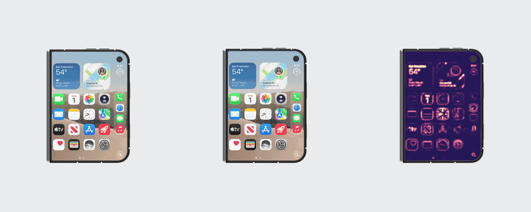
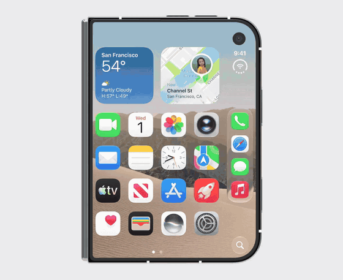
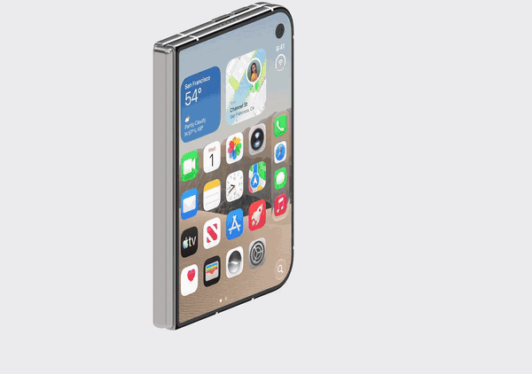
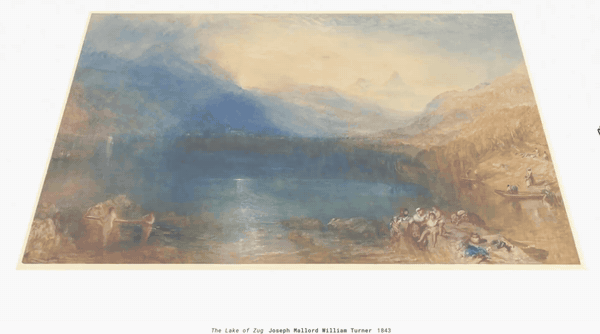
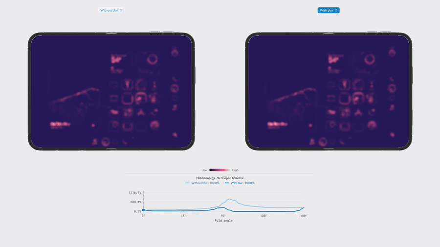
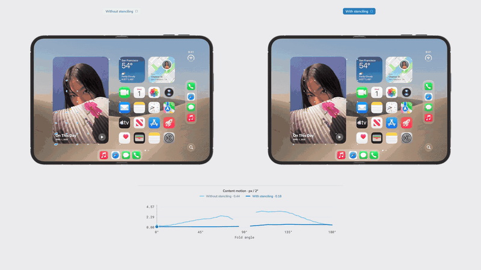

# iPhone Duo Transition

iPhone Duo opening and closing transitions recreated in Three.js by Armand Sumo, with a supporting interactive tracing-paper experiment and a lab that measures the effect.



- [iPhone Duo Transition — live lab](https://armandsumo.com/labs/iphone-duo-transition/)
- [Tracing Paper — supporting lab](https://armandsumo.com/labs/tracing-paper/)
- [Blur and Stencil — measurement lab](https://armandsumo.com/labs/iphone-duo-perception/)

| Transition | Orbit | Tracing paper |
| --- | --- | --- |
|  |  |  |

| Detail energy, without and with blur | Optical flow, without and with stenciling |
| --- | --- |
|  |  |

The article is maintained separately in the `armandsumo` website repository and is not included here.

## Run locally

```sh
npm install
npm run dev
```

Switch experiments using the top navigation (`#tracing-paper`, `#iphone-duo`, `#perception`). `npm run build` checks TypeScript and builds the static site; `npm run preview` serves the build.

## Assets

This repository contains source code, not a grant to redistribute third-party imagery or models. Supply authorized local files at these paths (gitignored):

```
public/assets/tracing-paper/lake-of-zug-turner-1843.jpeg
public/assets/tracing-paper/iphone-duo-clean-background.jpeg
public/assets/tracing-paper/iphone-duo-folded-cover.png
public/assets/tracing-paper/tomaselli-newspaper-reference.jpg
public/models/iphone-duo-full-replaced-screen.glb
```

The paper demo accepts a replacement image. The hosted version shows *The Lake of Zug*, Joseph Mallord William Turner, 1843; update its caption when substituting artwork. The phone implementation expects the supplied rig's mesh and bone names (see `coordinatedDisplayScene.ts`), so an arbitrary GLB is not a drop-in replacement. Without assets the app displays setup instructions and a hosted-demo link; the source still builds.

## Controls

Tracing Paper: slide over the paper to fold; choose Move view to orbit, or Top view to reset. Ray spread controls scattering.

Blur and Stencil: choose Image, Energy or Optical flow, and Blur or Stenciling; Fold / unfold plays the fold, or drag a phone or the graph. Click a phone's label to show it alone.

iPhone Duo: grab the moving screen to fold, drag the background to orbit, or use Open/Close. Inspect exposes eight rendering views and scattering/darkening controls. Arrow keys adjust the fold with the viewer focused; Home closes and End opens. Escape closes Inspect. Reduced motion is respected.

## Implementation

- `tracingPaperScene.ts`: hinged paper geometry and image scattering.
- `coordinatedDisplayScene.ts`: phone rig, projected image sampling, screen masks and material effects.
- `phonePerceptionScene.ts`: the measurement rig. Renders each phone with and without a treatment, computes detail energy (squared high-pass luminance) and tracks optical flow between neighbouring fold angles (`renderedOpticalFlow.ts`).
- The React components own controls, pointer gestures and eased transitions.

This is a visual reconstruction, not a claim about Apple's display hardware or a validated physical light solver. Not affiliated with Apple.

## License

Original source code is MIT licensed; see LICENSE. The license does not cover separately supplied artwork, phone models, screen imagery, or Apple trademarks. The recordings in `docs/media` show that imagery and are included for illustration only; they are not covered by the MIT license.
